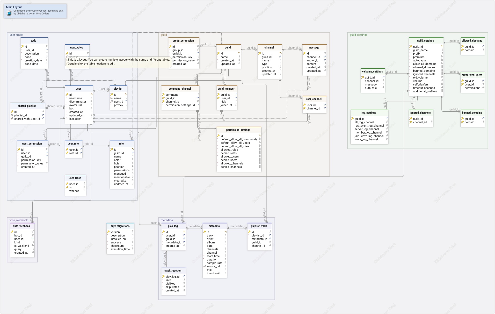

#Main Layout
Generated using [DbSchema](https://dbschema.com)

### Main Layout

## Tables

1. [public._sqlx_migrations](#table%20public.\_sqlx\_migrations) 
2. [public.allowed_domains](#table%20public.allowed\_domains) 
3. [public.authorized_users](#table%20public.authorized\_users) 
4. [public.banned_domains](#table%20public.banned\_domains) 
5. [public.channel](#table%20public.channel) 
6. [public.command_channel](#table%20public.command\_channel) 
7. [public.group_permission](#table%20public.group\_permission) 
8. [public.guild](#table%20public.guild) 
9. [public.guild_member](#table%20public.guild\_member) 
10. [public.guild_settings](#table%20public.guild\_settings) 
11. [public.ignored_channels](#table%20public.ignored\_channels) 
12. [public.log_settings](#table%20public.log\_settings) 
13. [public.message](#table%20public.message) 
14. [public.metadata](#table%20public.metadata) 
15. [public.permission_settings](#table%20public.permission\_settings) 
16. [public.play_log](#table%20public.play\_log) 
17. [public.playlist](#table%20public.playlist) 
18. [public.playlist_track](#table%20public.playlist\_track) 
19. [public.role](#table%20public.role) 
20. [public.shared_playlist](#table%20public.shared\_playlist) 
21. [public.todo](#table%20public.todo) 
22. [public.track_reaction](#table%20public.track\_reaction) 
23. [public.user](#table%20public.user) 
24. [public.user_channel](#table%20public.user\_channel) 
25. [public.user_permission](#table%20public.user\_permission) 
26. [public.user_role](#table%20public.user\_role) 
27. [public.user_trace](#table%20public.user\_trace) 
28. [public.user_votes](#table%20public.user\_votes) 
29. [public.vote_webhook](#table%20public.vote\_webhook) 
30. [public.welcome_settings](#table%20public.welcome\_settings) 

### Table public._sqlx_migrations 
|Idx |Name |Data Type |
|---|---|---|
| * &#128273;  | version| bigint  |
| * | description| text  |
| * | installed\_on| timestamptz  DEFAULT now() |
| * | success| boolean  |
| * | checksum| bytea  |
| * | execution\_time| bigint  |

##### Indexes 
|Type |Name |On |
|---|---|---|
| &#128273;  | \_sqlx\_migrations\_pkey | ON version|

### Table public.allowed_domains 
|Idx |Name |Data Type |
|---|---|---|
| * &#128273;  &#11016; | guild\_id| bigint  |
| * &#128273;  | domain| text  |

##### Indexes 
|Type |Name |On |
|---|---|---|
| &#128273;  | allowed\_domains\_pkey | ON guild\_id, domain|

##### Foreign Keys
|Type |Name |On |
|---|---|---|
|  | fk_allowed_domains | ( guild\_id ) ref [public.guild\_settings](#guild\_settings) (guild\_id) |

### Table public.authorized_users 
|Idx |Name |Data Type |
|---|---|---|
| * &#128273;  &#11016; | guild\_id| bigint  |
| * &#128273;  | user\_id| bigint  |
|  | permissions| bigint  |

##### Indexes 
|Type |Name |On |
|---|---|---|
| &#128273;  | authorized\_users\_pkey | ON guild\_id, user\_id|

##### Foreign Keys
|Type |Name |On |
|---|---|---|
|  | fk_authorized_users | ( guild\_id ) ref [public.guild\_settings](#guild\_settings) (guild\_id) |

### Table public.banned_domains 
|Idx |Name |Data Type |
|---|---|---|
| * &#128273;  &#11016; | guild\_id| bigint  |
| * &#128273;  | domain| text  |

##### Indexes 
|Type |Name |On |
|---|---|---|
| &#128273;  | banned\_domains\_pkey | ON guild\_id, domain|

##### Foreign Keys
|Type |Name |On |
|---|---|---|
|  | fk_banned_domains | ( guild\_id ) ref [public.guild\_settings](#guild\_settings) (guild\_id) |

### Table public.channel 
|Idx |Name |Data Type |
|---|---|---|
| * &#128273;  &#11019; | id| bigint  |
| &#11016; | guild\_id| bigint  |
|  | name| text  |
|  | type| text  |
|  | position| integer  |
|  | created\_at| timestamp  |
|  | updated\_at| timestamp  |

##### Indexes 
|Type |Name |On |
|---|---|---|
| &#128273;  | channel\_pkey | ON id|

##### Foreign Keys
|Type |Name |On |
|---|---|---|
|  | fk_channel | ( guild\_id ) ref [public.guild](#guild) (id) |

### Table public.command_channel 
|Idx |Name |Data Type |
|---|---|---|
| * &#128273;  | command| text  |
| * &#128273;  &#11016; | guild\_id| bigint  |
| * &#128273;  | channel\_id| bigint  |
| * &#11016; | permission\_settings\_id| bigint  |

##### Indexes 
|Type |Name |On |
|---|---|---|
| &#128273;  | command\_channel\_pkey | ON command, guild\_id, channel\_id|

##### Foreign Keys
|Type |Name |On |
|---|---|---|
|  | fk_command_channel_permission_settings_id | ( permission\_settings\_id ) ref [public.permission\_settings](#permission\_settings) (id) |
|  | fk_command_channel_guild_id | ( guild\_id ) ref [public.guild](#guild) (id) |

### Table public.group_permission 
|Idx |Name |Data Type |
|---|---|---|
| * &#128273;  | id| serial  |
| * | group\_id| bigint  |
| * &#11016; | guild\_id| bigint  |
| * | permission\_key| text  |
| * | permission\_value| integer  |
| * | created\_at| timestamp  DEFAULT CURRENT_TIMESTAMP |

##### Indexes 
|Type |Name |On |
|---|---|---|
| &#128273;  | group\_permission\_pkey | ON id|

##### Foreign Keys
|Type |Name |On |
|---|---|---|
|  | fk_guild_id | ( guild\_id ) ref [public.guild](#guild) (id) |

### Table public.guild 
|Idx |Name |Data Type |
|---|---|---|
| * &#128273;  &#11019; | id| bigint  |
| * | name| text  |
| * | created\_at| timestamp  DEFAULT CURRENT_TIMESTAMP |
| * | updated\_at| timestamp  DEFAULT CURRENT_TIMESTAMP |

##### Indexes 
|Type |Name |On |
|---|---|---|
| &#128273;  | guild\_pkey | ON id|

### Table public.guild_member 
|Idx |Name |Data Type |
|---|---|---|
| * &#128273;  &#11016; | guild\_id| bigint  |
| * &#128273;  &#11016; | user\_id| bigint  |
|  | nick| text  |
|  | joined\_at| timestamp  |

##### Indexes 
|Type |Name |On |
|---|---|---|
| &#128273;  | guild\_member\_pkey | ON guild\_id, user\_id|

##### Foreign Keys
|Type |Name |On |
|---|---|---|
|  | guild_member_user_id_fkey | ( user\_id ) ref [public.user](#user) (id) |
|  | fk_guild_member | ( guild\_id ) ref [public.guild](#guild) (id) |

### Table public.guild_settings 
|Idx |Name |Data Type |
|---|---|---|
| * &#128273;  &#11019; | guild\_id| bigint  |
| * | guild\_name| text  |
| * | prefix| text  DEFAULT 'r!'::text |
| * | premium| boolean  DEFAULT false |
| * | autopause| boolean  DEFAULT false |
| * | allow\_all\_domains| boolean  DEFAULT true |
| * | allowed\_domains| text[]  DEFAULT '{}'::text[] |
| * | banned\_domains| text[]  DEFAULT '{}'::text[] |
| * | ignored\_channels| bigint[]  DEFAULT '{}'::bigint[] |
| * | old\_volume| double precision  DEFAULT 1.0 |
| * | volume| double precision  DEFAULT 1.0 |
| * | self\_deafen| boolean  DEFAULT true |
| * | timeout\_seconds| integer  DEFAULT 360 |
| * | additional\_prefixes| text[]  DEFAULT '{}'::text[] |

##### Indexes 
|Type |Name |On |
|---|---|---|
| &#128273;  | guild\_settings\_pkey | ON guild\_id|

### Table public.ignored_channels 
|Idx |Name |Data Type |
|---|---|---|
| * &#128273;  &#11016; | guild\_id| bigint  |
| * &#128273;  | channel\_id| bigint  |

##### Indexes 
|Type |Name |On |
|---|---|---|
| &#128273;  | ignored\_channels\_pkey | ON guild\_id, channel\_id|

##### Foreign Keys
|Type |Name |On |
|---|---|---|
|  | fk_ignored_channels | ( guild\_id ) ref [public.guild\_settings](#guild\_settings) (guild\_id) |

### Table public.log_settings 
|Idx |Name |Data Type |
|---|---|---|
| * &#128273;  &#11016; | guild\_id| bigint  |
|  | all\_log\_channel| bigint  |
|  | raw\_event\_log\_channel| bigint  |
|  | server\_log\_channel| bigint  |
|  | member\_log\_channel| bigint  |
|  | join\_leave\_log\_channel| bigint  |
|  | voice\_log\_channel| bigint  |

##### Indexes 
|Type |Name |On |
|---|---|---|
| &#128273;  | log\_settings\_pkey | ON guild\_id|

##### Foreign Keys
|Type |Name |On |
|---|---|---|
|  | fk_log_settings | ( guild\_id ) ref [public.guild\_settings](#guild\_settings) (guild\_id) |

### Table public.message 
|Idx |Name |Data Type |
|---|---|---|
| * &#128273;  | id| bigint  |
| &#11016; | channel\_id| bigint  |
| &#11016; | author\_id| bigint  |
|  | content| text  |
|  | created\_at| timestamp  |
|  | updated\_at| timestamp  |

##### Indexes 
|Type |Name |On |
|---|---|---|
| &#128273;  | message\_pkey | ON id|

##### Foreign Keys
|Type |Name |On |
|---|---|---|
|  | message_author_id_fkey | ( author\_id ) ref [public.user](#user) (id) |
|  | fk_message | ( channel\_id ) ref [public.channel](#channel) (id) |

### Table public.metadata 
|Idx |Name |Data Type |
|---|---|---|
| * &#128273;  &#11019; | id| serial  |
|  | track| text  |
|  | artist| text  |
|  | album| text  |
|  | date| date  |
|  | channels| smallint  |
|  | channel| text  |
| * | start\_time| bigint  DEFAULT 0 |
| * | duration| bigint  DEFAULT 0 |
|  | sample\_rate| integer  |
| &#128270; | source\_url| text  |
|  | title| text  |
|  | thumbnail| text  |

##### Indexes 
|Type |Name |On |
|---|---|---|
| &#128273;  | metadata\_pkey | ON id|
| &#128270;  | metadata\_track\_artist\_album\_idx | ON source\_url|

### Table public.permission_settings 
|Idx |Name |Data Type |
|---|---|---|
| * &#128273;  &#11019; | id| serial  |
| * | default\_allow\_all\_commands| boolean  |
| * | default\_allow\_all\_users| boolean  |
| * | default\_allow\_all\_roles| boolean  |
| * | allowed\_roles| bigint[]  |
| * | denied\_roles| bigint[]  |
| * | allowed\_users| bigint[]  |
| * | denied\_users| bigint[]  |
| * | allowed\_channels| bigint[]  DEFAULT ARRAY[]::bigint[] |
| * | denied\_channels| bigint[]  DEFAULT ARRAY[]::bigint[] |

##### Indexes 
|Type |Name |On |
|---|---|---|
| &#128273;  | permission\_settings\_pkey | ON id|

### Table public.play_log 
|Idx |Name |Data Type |
|---|---|---|
| * &#128273;  &#11019; | id| serial  |
| * &#11016; | user\_id| bigint  |
| * &#11016; | guild\_id| bigint  |
| * &#11016; | metadata\_id| bigint  |
| * | created\_at| timestamp  DEFAULT CURRENT_TIMESTAMP |

##### Indexes 
|Type |Name |On |
|---|---|---|
| &#128273;  | play\_log\_pkey | ON id|

##### Foreign Keys
|Type |Name |On |
|---|---|---|
|  | play_log_metadata_id_fkey | ( metadata\_id ) ref [public.metadata](#metadata) (id) |
|  | play_log_guild_id_fkey | ( guild\_id ) ref [public.guild\_settings](#guild\_settings) (guild\_id) |
|  | play_log_fk_constraint | ( user\_id ) ref [public.user](#user) (id) |

### Table public.playlist 
|Idx |Name |Data Type |
|---|---|---|
| * &#128273;  &#11019; | id| serial  |
| * &#128270; | name| text  |
| &#128270; &#11016; | user\_id| bigint  |
| * | privacy| text  DEFAULT 'private'::text |

##### Indexes 
|Type |Name |On |
|---|---|---|
| &#128273;  | playlist\_pkey | ON id|
| &#128270;  | playlist\_name\_user\_id\_idx | ON name, user\_id|

##### Foreign Keys
|Type |Name |On |
|---|---|---|
|  | fk_playlist_user | ( user\_id ) ref [public.user](#user) (id) |

##### Constraints
|Name |Definition |
|---|---|
| playlist_privacy_check | (privacy = ANY (ARRAY['public'::text, 'private'::text, 'shared'::text])) |

### Table public.playlist_track 
|Idx |Name |Data Type |
|---|---|---|
| * &#128273;  | id| serial  |
| * &#11016; | playlist\_id| integer  |
| * &#11016; | metadata\_id| integer  |
|  | guild\_id| bigint  |
|  | channel\_id| bigint  |

##### Indexes 
|Type |Name |On |
|---|---|---|
| &#128273;  | playlist\_track\_pkey | ON id|

##### Foreign Keys
|Type |Name |On |
|---|---|---|
|  | playlist_track_metadata_id_fkey | ( metadata\_id ) ref [public.metadata](#metadata) (id) |
|  | fk_playlist_track_playlist | ( playlist\_id ) ref [public.playlist](#playlist) (id) |

### Table public.role 
|Idx |Name |Data Type |
|---|---|---|
| * &#128273;  &#11019; | id| bigint  |
| &#11016; | guild\_id| bigint  |
|  | name| text  |
|  | color| integer  |
|  | hoist| boolean  |
|  | position| integer  |
|  | permissions| bigint  |
|  | managed| boolean  |
|  | mentionable| boolean  |
|  | created\_at| timestamp  |
|  | updated\_at| timestamp  |

##### Indexes 
|Type |Name |On |
|---|---|---|
| &#128273;  | role\_pkey | ON id|

##### Foreign Keys
|Type |Name |On |
|---|---|---|
|  | fk_role | ( guild\_id ) ref [public.guild](#guild) (id) |

### Table public.shared_playlist 
|Idx |Name |Data Type |
|---|---|---|
| * &#128273;  | id| serial  |
| &#128269; &#11016; | playlist\_id| bigint  |
| &#128269; &#11016; | shared\_with\_user\_id| bigint  |

##### Indexes 
|Type |Name |On |
|---|---|---|
| &#128273;  | shared\_playlist\_pkey | ON id|
| &#128269;  | uq\_shared\_playlist | ON playlist\_id, shared\_with\_user\_id|

##### Foreign Keys
|Type |Name |On |
|---|---|---|
|  | shared_playlist_shared_with_user_id_fkey | ( shared\_with\_user\_id ) ref [public.user](#user) (id) |
|  | shared_playlist_playlist_id_fkey | ( playlist\_id ) ref [public.playlist](#playlist) (id) |

### Table public.todo 
|Idx |Name |Data Type |
|---|---|---|
| * &#128273;  | id| serial  |
| * &#11016; | user\_id| bigint  |
| * | description| text  |
| * | done| boolean  DEFAULT false |
| * | creation\_date| date  DEFAULT CURRENT_DATE |
|  | done\_date| date  |

##### Indexes 
|Type |Name |On |
|---|---|---|
| &#128273;  | todo\_pkey | ON id|

##### Foreign Keys
|Type |Name |On |
|---|---|---|
|  | fk_todo_user | ( user\_id ) ref [public.user](#user) (id) |

### Table public.track_reaction 
|Idx |Name |Data Type |
|---|---|---|
| * &#128273;  &#11016; | play\_log\_id| integer  |
| * | likes| integer  DEFAULT 0 |
| * | dislikes| integer  DEFAULT 0 |
| * | skip\_votes| integer  DEFAULT 0 |
| * | created\_at| timestamp  DEFAULT CURRENT_TIMESTAMP |

##### Indexes 
|Type |Name |On |
|---|---|---|
| &#128273;  | track\_reaction\_pkey | ON play\_log\_id|

##### Foreign Keys
|Type |Name |On |
|---|---|---|
|  | fk_track_reaction_play_log | ( play\_log\_id ) ref [public.play\_log](#play\_log) (id) |

### Table public.user 
|Idx |Name |Data Type |
|---|---|---|
| * &#128273;  &#11019; | id| bigint  |
| * | username| text  |
|  | discriminator| smallint  |
| * | avatar\_url| text  DEFAULT ''::text |
| * | bot| boolean  |
| * | created\_at| timestamp  |
| * | updated\_at| timestamp  |
| * | last\_seen| timestamp  |

##### Indexes 
|Type |Name |On |
|---|---|---|
| &#128273;  | user\_pkey | ON id|

### Table public.user_channel 
|Idx |Name |Data Type |
|---|---|---|
| * &#128273;  &#11016; | user\_id| bigint  |
| * &#128273;  &#11016; | channel\_id| bigint  |

##### Indexes 
|Type |Name |On |
|---|---|---|
| &#128273;  | user\_channel\_pkey | ON user\_id, channel\_id|

##### Foreign Keys
|Type |Name |On |
|---|---|---|
|  | user_channel_channel_id_fkey | ( channel\_id ) ref [public.channel](#channel) (id) |
|  | fk_user_channel | ( user\_id ) ref [public.user](#user) (id) |

### Table public.user_permission 
|Idx |Name |Data Type |
|---|---|---|
| * &#128273;  | id| serial  |
| * &#11016; | user\_id| bigint  |
| * &#11016; | guild\_id| bigint  |
| * | permission\_key| text  |
| * | permission\_value| integer  |
| * | created\_at| timestamp  DEFAULT CURRENT_TIMESTAMP |

##### Indexes 
|Type |Name |On |
|---|---|---|
| &#128273;  | user\_permission\_pkey | ON id|

##### Foreign Keys
|Type |Name |On |
|---|---|---|
|  | user_permission_guild_id_fkey | ( guild\_id ) ref [public.guild](#guild) (id) |
|  | fk_user_guild_id | ( user\_id ) ref [public.user](#user) (id) |

### Table public.user_role 
|Idx |Name |Data Type |
|---|---|---|
| * &#128273;  &#11016; | user\_id| bigint  |
| * &#128273;  &#11016; | role\_id| bigint  |

##### Indexes 
|Type |Name |On |
|---|---|---|
| &#128273;  | user\_role\_pkey | ON user\_id, role\_id|

##### Foreign Keys
|Type |Name |On |
|---|---|---|
|  | user_role_role_id_fkey | ( role\_id ) ref [public.role](#role) (id) |
|  | fk_user_role | ( user\_id ) ref [public.user](#user) (id) |

### Table public.user_trace 
|Idx |Name |Data Type |
|---|---|---|
| * &#128273;  | user\_id| bigint  |
| * &#128273;  | ts| timestamp  |
|  | whence| text  |

##### Indexes 
|Type |Name |On |
|---|---|---|
| &#128273;  | user\_trace\_pkey | ON user\_id, ts|

### Table public.user_votes 
|Idx |Name |Data Type |
|---|---|---|
| * &#128273;  | id| serial  |
| * &#128270; &#11016; | user\_id| bigint  |
| * &#128270; | timestamp| timestamp  |
| * &#128270; | site| text  |

##### Indexes 
|Type |Name |On |
|---|---|---|
| &#128273;  | user\_votes\_pkey | ON id|
| &#128270;  | user\_votes\_user\_id\_idx | ON user\_id, timestamp, site|

##### Foreign Keys
|Type |Name |On |
|---|---|---|
|  | crack_voting_user_id_fkey | ( user\_id ) ref [public.user](#user) (id) |

### Table public.vote_webhook 
|Idx |Name |Data Type |
|---|---|---|
| * &#128273;  | id| serial  |
| * | bot\_id| bigint  |
| * &#11016; | user\_id| bigint  |
| * | kind| webhook\_kind  |
| * | is\_weekend| boolean  |
|  | query| text  |
| * | created\_at| timestamp  DEFAULT CURRENT_TIMESTAMP |

##### Indexes 
|Type |Name |On |
|---|---|---|
| &#128273;  | vote\_webhook\_pkey | ON id|

##### Foreign Keys
|Type |Name |On |
|---|---|---|
|  | fk_vote_webhook_user_id | ( user\_id ) ref [public.user](#user) (id) |

### Table public.welcome_settings 
|Idx |Name |Data Type |
|---|---|---|
| * &#128273;  &#11016; | guild\_id| bigint  |
|  | channel\_id| bigint  |
|  | message| text  |
|  | auto\_role| bigint  |

##### Indexes 
|Type |Name |On |
|---|---|---|
| &#128273;  | welcome\_settings\_pkey | ON guild\_id|

##### Foreign Keys
|Type |Name |On |
|---|---|---|
|  | fk_welcome_settings | ( guild\_id ) ref [public.guild\_settings](#guild\_settings) (guild\_id) |

